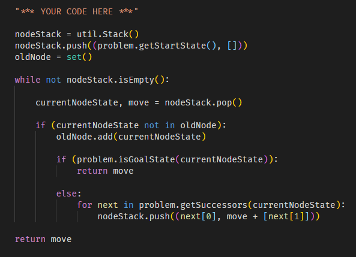
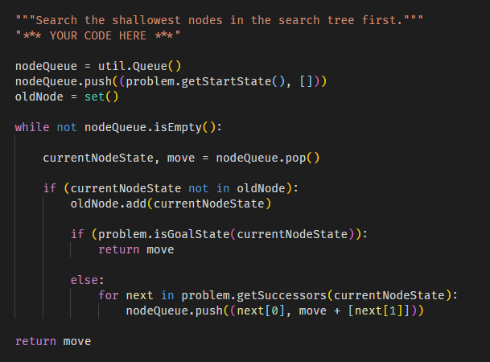

# 18020651 - Nguyễn Văn Huy 😁

## **How To Run? 🤔**

### Normal

```
py -2 pacman.py
```

### [**Question 1️⃣ ( depthFirstSearch )**](https://github.com/NoCtrlZ1110/Pacman-Search/issues/1)

```python
python pacman.py -l tinyMaze -p SearchAgent
```

```python
python pacman.py -l mediumMaze -p SearchAgent
```

```python
python pacman.py -l bigMaze -z .5 -p SearchAgent
```

#### Mô tả :



`nodeStack` - ngăn xếp dùng để chứa các node trong quá trình duyệt DFS.

`oldNode` - 1 set lưu trữ các node đã duyệt qua

`currentNodeState` - trạng thái, state của node hiện tại đang duyệt tới

`move` - các bước đi (actions) từ vị trí ban đầu tới node hiện tại

👉 Duyệt DFS cho đến khi `nodeStack` không còn phần tử nào hoặc khi đạt được tới `goalState`

### [**Question 2️⃣ ( breadthFirstSearch )**](https://github.com/NoCtrlZ1110/Pacman-Search/issues/2)

```python
python pacman.py -l mediumMaze -p SearchAgent -a fn=bfs
```

```python
python pacman.py -l bigMaze -p SearchAgent -a fn=bfs -z .5
```

```python
python autograder.py
```

#### Mô tả :



👉 Tương tự `Question 1` nhưng thay vì sử dụng `Stack` thì ta sử dụng `Queue` để duyệt BFS
